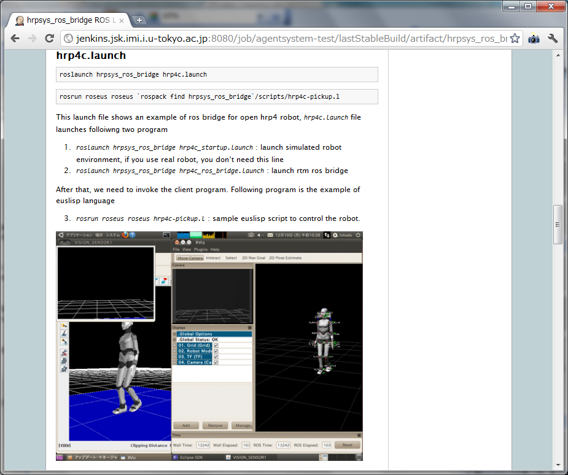

RTMROS相互運用 継続的インテグレーション例
-----------------------------------------

- 関連ソースコードのダウンロード

インストーラーを用い，相互運用に必要な関連ソースコードを国内外の１７リ
ポジトリからダウンロード

::

  $ rosinstall ~/prog/rtm-ros-robotics
  http://rtm-ros-robotics.googlecode.com/svn/tags/latest/agentsystem_ros_tutorials/rtm-ros-robotics.rosinstall

インストール設定ファイル（rtm-ros-robotics.rosinstall）の抜粋

::

  ## agentsystem lecture
  - svn:
      uri: https://rtm-ros-robotics.googlecode.com/svn/trunk/rtmros_common
      local-name: rtm-ros-robotics/rtmros_common
  
  ## cmu for imagesift
  - svn:
      uri: https://cmu-ros-pkg.svn.sourceforge.net/svnroot/cmu-ros-pkg/trunk
      local-name: cmu-ros-pkg
  
  ## android application platform
  - svn:
      uri: https://code.ros.org/svn/ros/stacks/multimaster_experimental/trunk
      local-name: multimaster_experimental
  - hg:
      uri: https://kforge.ros.org/turtlebot/turtlebot
      local-name: turtlebot

- 必要なライブラリのインストール

各パッケージの設定ファイル(manifest.xml)に必要ライブラリを記述

::
  <package>
    <description brief="hrpsys">
    Basic RT components and utilities to control robots using OpenRTM
    </description>
    <depend package="openhrp3"/>
    <rosdep name="doxygen"/>
  </package>

ライブラリのインストール方法をＯＳ，バージョン別に記述
(https://code.ros.org/trac/ros/browser/stacks/documentation/trunk/rosdep.yaml)

::

  doxygen:
    ubuntu: doxygen
    fedora: doxygen
    rhel: doxygen
    arch: doxygen
    debian: doxygen
    macports: doxygen
    gentoo: app-doc/doxygen 

hrpsysが必要とするライブラリ（上記例ではdoxygen)のインストール

::
  
  $ rosdep install hrpsys

- コンパイル
各パッケージの設定ファイル(manifest.xml)に依存ソフトウェア，ＩＤＬメッ
セージを記述

::

  <package>
    <description brief=“mrobot_ros_bridge”>mrobot_ros_brid</description>
      <depend package=“openhrp3”/>　　　　←　OpenHRP3への依存
      <depend package=“iis_idl”/>　　　　　←　知能移動モジュールIDL
  　　<depend package=“move_base”/>    ←　ＲＯＳ移動モジュール
  　　<depend package=“amcl”/>         ←　ＲＯＳ自己位置同定モジル
  　　<depend package=“jsk_maps”/>　　　　←　実験環境の地図状法
  </package>

コンパイル設定ファイル（CMakeLists.txt）にソースコードと実行ファイル名
を記述

::
   
   rtmbuild_init()
   rtmbuild_add_executable(MobileRobotROSBridgeComp src/MobileRobotROSBridge.cpp src/MobileRobotROSBridgeComp.cpp)

コンパイルコマンド（パッケージソースコード開発管理ツール）により，この
パッケージが依存するパッケージやＩＤＬのコンパイルとリンクを自動的に行
う．

::

  $ rosmake mrobot_ros_bridge

- コンパイルの成否の報告
ＣＩの起動はソースコードのコミットがトリガとなるため，原因となるコード
をコミットした本人にコンパイルの成否が伝えられる．

.. figure:: images/ros_jenkins_compile_result.*

- テスト
プログラムコンポーネント起動設定ファイル(hrp4c.launch)に起動するべきコ
ンポーネント，並びにテストプログラムを記述

::

  <launch>
    <include file="$(find hrpsys_ros_bridge)/launch/hrp4c_startup.launch" />
    <include file="$(find hrpsys_ros_bridge)/launch/hrp4c_ros_bridge.launch" />
     <test type="test-grxui.py" pkg="openhrp3" time-limit="600" retry="2"
           test-name="HRP4C_PickUp" args="--max-time=240 --capture-window RViz
           --target-directory=$(find hrpsys_ros_bridge)/build/images
           --check-tf='/BODY /R_HAND_J1_LINK'
           --script='rosrun roseus roseus
  　　　　　　　　　 $(find hrpsys_ros_bridge)/scripts/hrp4c-pickup.l  __log:=dummy'" />
  </launch>

プログラムコンポーネント実行管理ツールによる起動

::

  $ roslaunch hrpsys_ros_bridge hrp4c.launch

Includeタグ内でプログラムコンポーネントを起動し，testタグでテストスク
リプトを実行
test-grxui.py では，eclipseの起動，スタートボタンを押す，必要なプロセ
スが立ち上がっていることを確認，画面の連続キャプチャ，動画ファイルの生
成を行い，途中で失敗があれば異常終了する

- サンプル動作検証結果のレポート

.. figure:: images/ros_jenkins_test_result.*

- 安定版ブランチの生成
開発は
http://rtm-ros-robotics.googlecode.com/svn/trunk/rtmros_common
を利用し，テストが通ったコードは
http://rtm-ros-robotics.googlecode.com/svn/tags/latest/rtmros_common
へとコピーする．
さらにインストール設定ファイルも，外部のソースコードに対してテストが通っ
たバージョンを指定しlatest以下にコピーする．以下はlatest以下のインストー
ル設定ファイルの例

::
  
  - svn: {local-name: cmu-ros-pkg, uri:
    'https://cmu-ros-pkg.svn.sourceforge.net/svnroot/cmu-ros-pkg/trunk',
    version: -r435}
  - svn: {local-name: multimaster_experimental, uri:
    'https://code.ros.org/svn/ros/stacks/multimaster_experimental/trunk',
    version: -r15444}
  - hg: {local-name: turtlebot, uri:
    'https://kforge.ros.org/turtlebot/turtlebot', version:
    492a99d77ef1}  

過去一週間のコミットのうちＣＩ環境による自動コミットは３９％（２６/６
  ７）
→　開発者は自由にコードの変更を続けながら，講義・演習を含めユーザは常
  に安定なソースコードを利用できる仕組み

- サンプル実行方法ドキュメント生成
プログラムコンポーネント起動設定ファイル(hrp4c.launch)にドキュメントを
埋め込み，ここからＨＴＭＬを自動生成する

::
  
  <launch>
    <include file=" … " />
    <include file=" … " />
     <sphinxdoc><![CDATA[
  .. code-block:: bash
    rosrun roseus roseus `rospack find
    hrpsys_ros_bridge`/scripts/hrp4c-pickup.l
  
  This launch file shows an example of ros bridge for open hrp4 robot,
  `hrp4c.launch` file launches folloiwng two program
  1. `roslaunch hrpsys_ros_bridge hrp4c_startup.launch` : launch
  simulated robot environment, if you use real robot, you don't need
  this line
  2. `roslaunch hrpsys_ros_bridge hrp4c_ros_bridge.launch` : launch rtm
  ros bridge
  After that, we need to invoke the client program. Following program is
  the example of euslisp language
  3. `rosrun roseus roseus hrp4c-pickup.l` : sample euslisp script to
  control the robot.
  .. image:: build/images/HRP4C_PickUp.gif
    :width: 600
    ]]></sphinxdoc>
  　　<test type="test-grxui.py" pkg="openhrp3" … /> 
  </launch>

